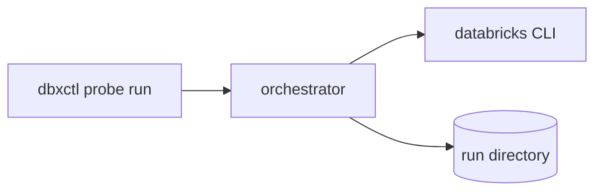

<!--
For AI-written descriptions:
- Follow this template (Related issue, Summary, Diagram, Test plan, Evidence,
  Type of change, Test coverage, Coverage notes, Checks, Safety and supply
  chain, Design decisions, Release notes, Changelog).
- Keep it concise; explain the cause, fix, and proof once, in plain language.
- Always fill in the ELI5. Add a diagram only when it makes a flow,
  relationship, or ordering easier to follow; otherwise delete that section.
- Keep every other section and checkbox row in place, except Changelog when
  instructed below.
- Choose exactly one Release notes checkbox; if Yes, write the entry in
  Changelog.
- Never paste tokens, workspace hosts, workspace or pipeline IDs, or
  user-specific paths. Redact them in any command output.
-->

## Related issue

<!--
Link the issue this PR addresses with a closing keyword, e.g. `Closes #123`.
One issue per PR. A `Refactor / chore`, `Docs`, or `Test / CI` change does not
require an issue.
-->

Closes #

## Summary

**ELI5:** <!-- One or two sentences a newcomer could understand: what this does and why it matters. -->

<!-- What changed and why, in 1-3 bullets or a short paragraph. -->

## Diagram

<!--
Optional. Include a Mermaid diagram when it clarifies a flow, dependency, or
sequence (for example, the CLI calls a probe makes, or how modules depend on
each other). Delete this section if it would not help.

-->

## Test plan

<!-- How was this change tested? List the commands, scenarios, or fixtures used. -->

## Evidence

<!--
Show proof the change works: redacted terminal output, a findings excerpt, or
a CI run link. For non-behavioral changes, choose "Not applicable".
-->

- [ ] Redacted command output or CI link provided below or in Test plan
- [ ] Not applicable — no behavioral change

## Type of change

- [ ] Bug fix
- [ ] Feature
- [ ] Refactor / chore
- [ ] Docs
- [ ] Test / CI
- [ ] Supply chain / security
- [ ] Breaking change

## Test coverage

<!-- Check all that apply. Be honest: reviewers and agents use this to spot coverage gaps. -->

- [ ] Unit tests added / updated
- [ ] Wrapper-contract tests added / updated (fake Databricks CLI)
- [ ] Upstream-contract tests added / updated (pinned Databricks CLI)
- [ ] Script tests added / updated (`tests/test_*.py`)
- [ ] Manual verification completed
- [ ] Existing tests cover this change
- [ ] Not applicable

## Coverage notes

<!--
Required if you checked "Manual verification completed" or "Not applicable"
above. Describe what you verified manually, or why automated coverage is not
needed. Line coverage must stay at or above 90%.
-->

## Checks

- [ ] `cargo fmt --check`
- [ ] `cargo clippy --locked --all-targets --all-features`
- [ ] `cargo test --locked --all-features`
- [ ] `cargo llvm-cov` line coverage at or above 90%
- [ ] `scripts/markdown.sh check`
- [ ] `cargo deny check` and `cargo audit` (required if `Cargo.toml` or `Cargo.lock` changed)

## Safety and supply chain

<!-- Check each row that holds. Explain any unchecked row in Summary. -->

- [ ] No new runtime dependency, or the dependency is approved in a recorded design decision
- [ ] Workspace access goes only through the resolved `databricks` executable (no HTTP client, shell, or async runtime)
- [ ] Read-only by default is preserved; any mutation requires the `Mutate` capability
- [ ] Fixtures, logs, and examples contain no credentials, hosts, workspace IDs, or user paths
- [ ] New or changed GitHub Actions and downloaded tools are pinned by full SHA or SHA-256

## Design decisions

<!--
List any design decision this PR records or implements by its DP<phase>-<n>
ID, with a link to its record. Write "None" if not applicable.

Nomenclature and existing records:
- DP0-1: https://github.com/R7L208/dbxctl/blob/main/docs/security.md#dp0-1-json-handling
- DP1-1: https://github.com/R7L208/dbxctl/blob/main/docs/mv-lineage/design/dp1-1-graph-construction.md
- All design records: https://github.com/R7L208/dbxctl/tree/main/docs/mv-lineage/design
- Propose a new decision: https://github.com/R7L208/dbxctl/issues/new?template=planning.yml
-->

## Release notes

Should this change be included in the release notes? Choose exactly one.

- [ ] No — no noteworthy user-facing change.
- [ ] Yes — include the entry in the Changelog section.

<!--
Choose Yes for user-facing commands, behavior changes, bug fixes users would
notice, and breaking changes. Breaking changes must choose Yes and explain the
compatibility impact in Changelog. Choose No for CI, refactors, test-only
changes, documentation, and dependency bumps with no user impact.
-->

## Changelog

<!--
One line, in the user's voice, describing the user-facing change.
If you chose No in Release notes, DELETE THIS WHOLE SECTION. A breaking change
must always keep this section.

Example: `dbxctl probe report --from <dir>` regenerates findings from a saved run
-->

<Add a line to describe the change, else delete this section>
